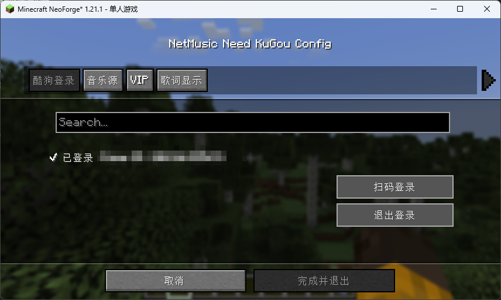
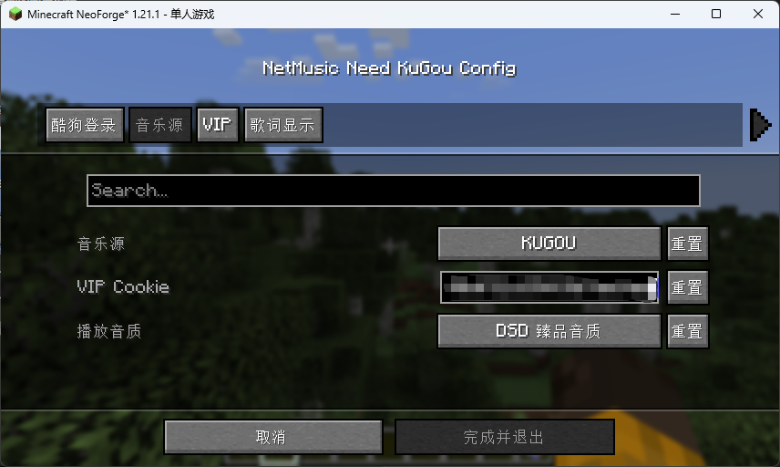
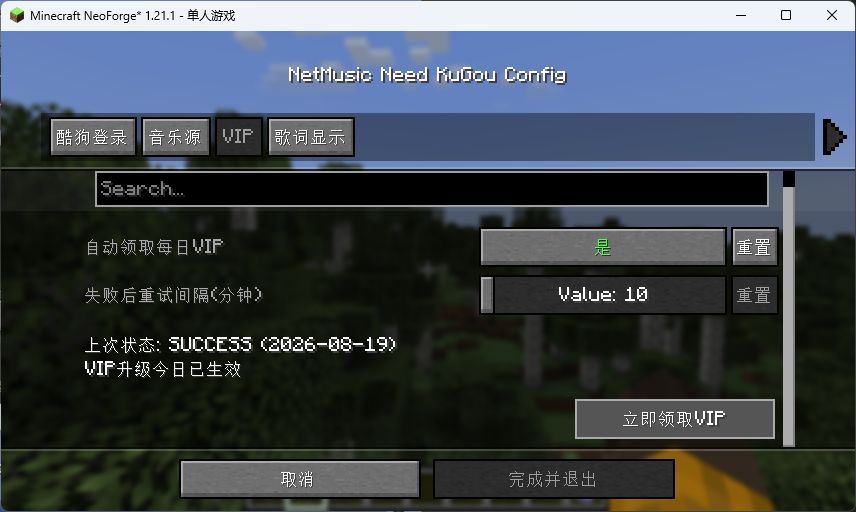
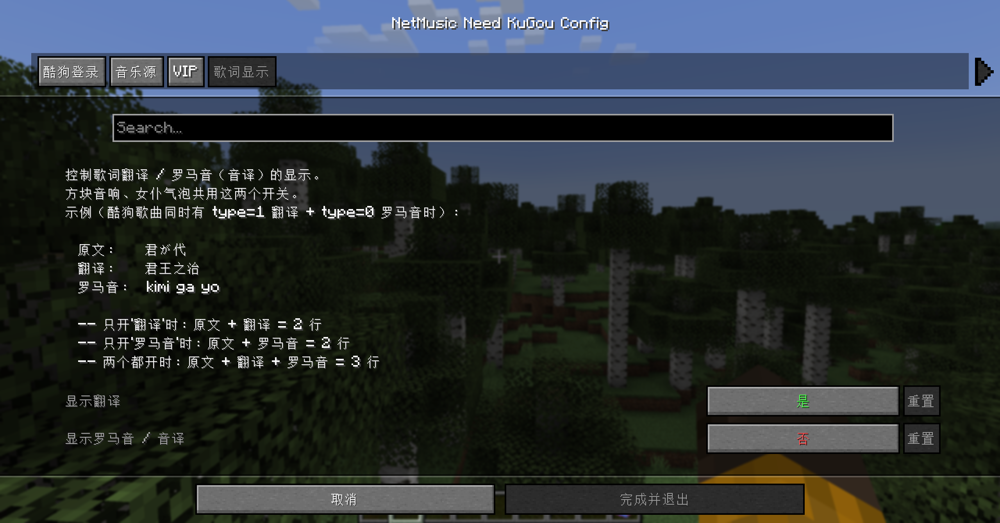
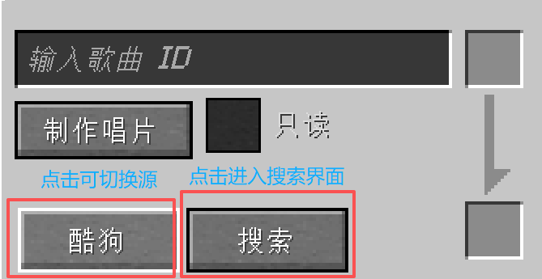
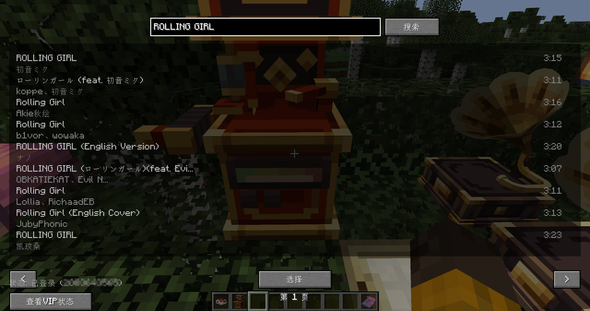
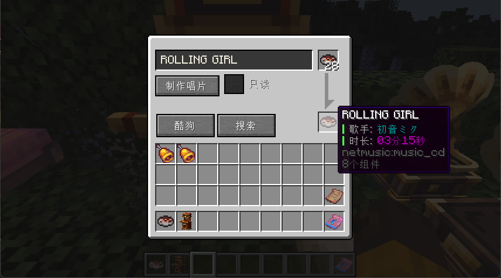

# NetMusicNeedKuGou

> 本模组对[NetMusic](https://www.mcmod.cn/class/4935.html)添加了酷狗概念版渠道！！！
>
> 加入了搜索音乐的功能（从酷狗来的）
>
> 支持扫码登录概念版账号
>
> 支持不同音质选择

***⚠VIP歌曲需要在登录状态且拥有VIP权限才能刻录***

***目前本mod处于初步开发测试阶段，问题比较多且无兼容其他的附属模组。***

# 配置界面

> - 在模组里搜索"NetMusicNeedKuGou"后点击配置按钮即可进入配置界面
>

>
> - 在第一页即登录界面可以用概念版扫码登录（首次使用请先注册《酷狗概念版》账号）
>

>
> - 第二页即选择刻录机的音乐源（在刻录机里也可选择）、VIP Cookie（登录完成自动填入）与音质选择
>

>
> - 第三页即自动领取VIP配置界面（默认关闭）。
>

> * 第四页即歌词显示配置(不推荐打开罗马音)

# 刻录

> - 唱片刻录机的界面
>

> - 在搜索界面可以搜索歌曲并选择
>

>
> - 选择好歌曲后提供唱片点击制作唱片即可
>

>
> *不要问界面为什么那么像"**看你的QQ"因为就是借鉴的***

***

# 关于多人联机

> - 其实与单机模式一样，只要刻录下来了歌曲一般都能正常播放,别人也能听到

# 关于酷狗无版权歌曲刻录问题

> - 获取不到歌曲的URL，但是很快这个问题一定会被解决awa（画饼.ing）
