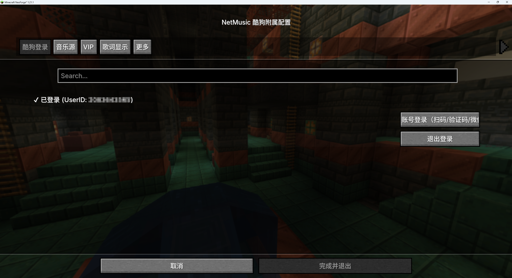
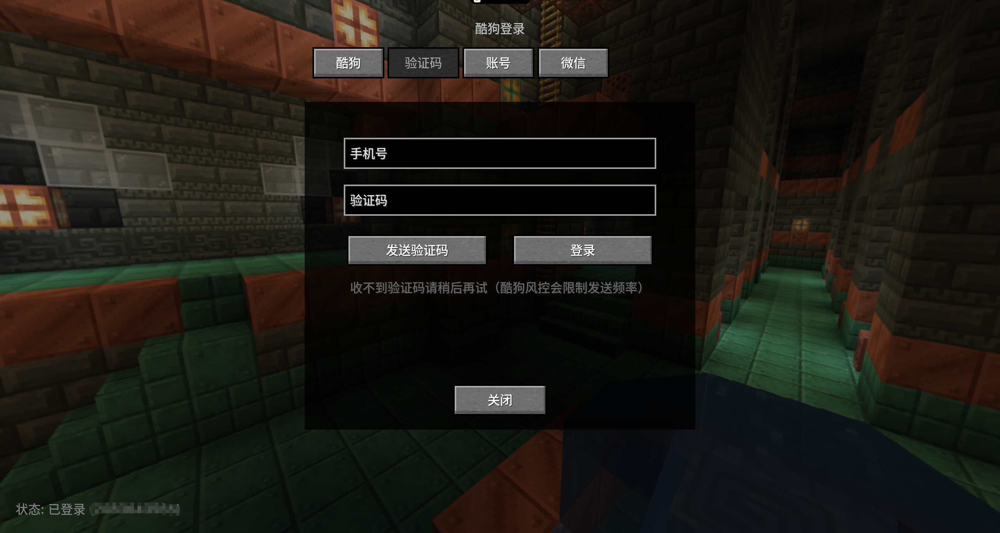
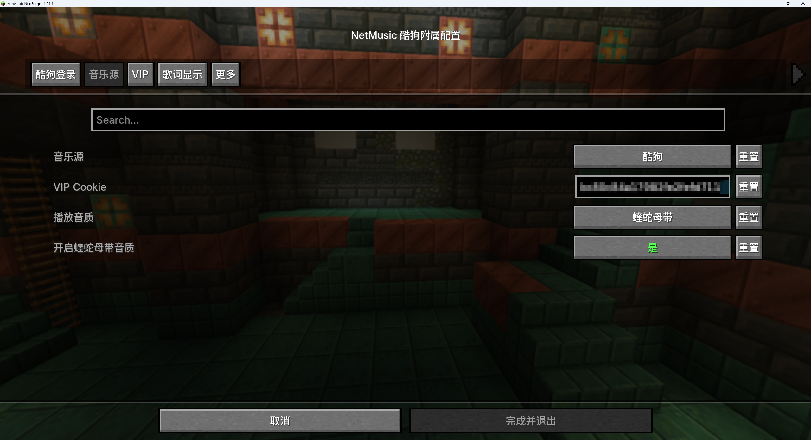
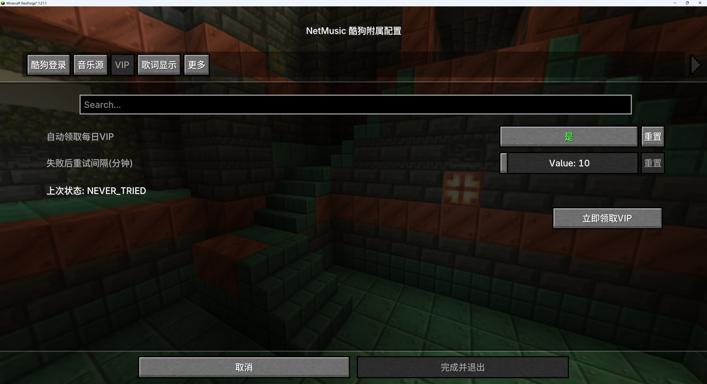
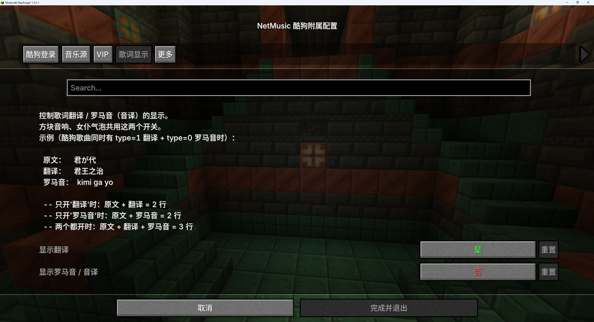
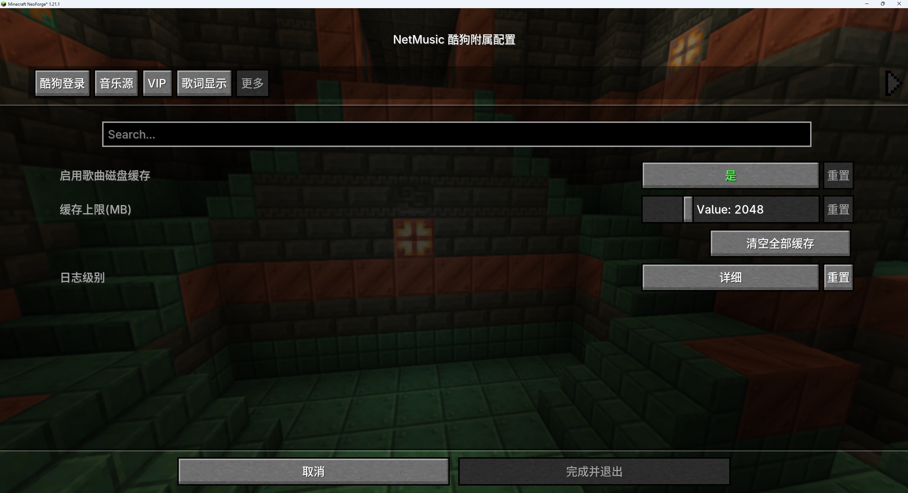
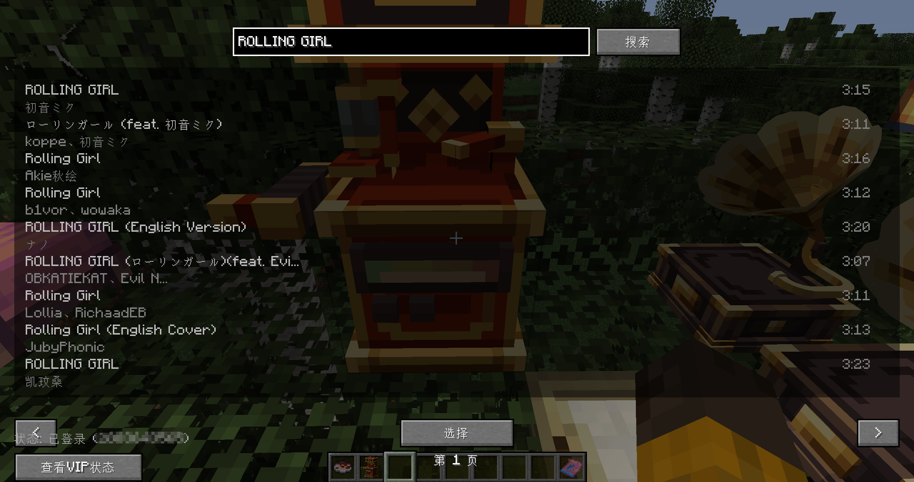
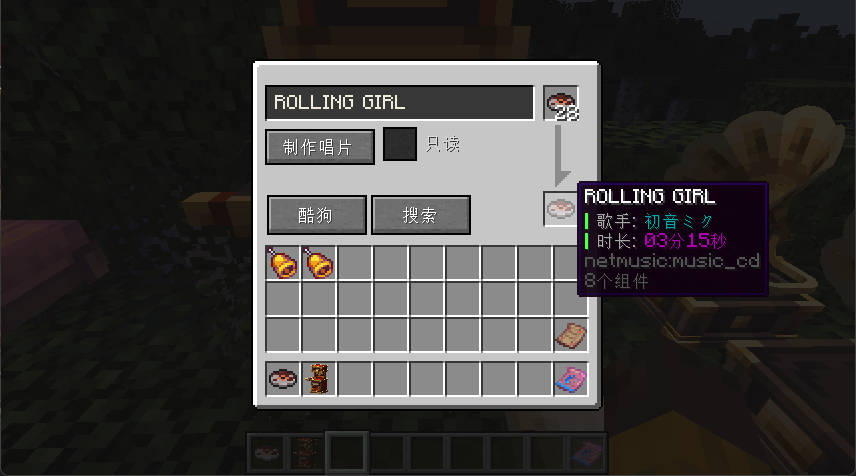

# NetMusicNeedKuGou

给 [NetMusic](https://www.mcmod.cn/class/4935.html)加上 **酷狗概念版渠道** 的扩展插件 在原版刻录机里可直接搜索歌曲刻成唱片，播放时带歌词

- 当前分支：**Minecraft 1.20.1 Forge**
- Mod ID：`netmusic_kugou` ｜ 作者：ATXLS ｜ 许可：GPL-3.0

---

## 功能

- **在线搜索**酷狗曲库，可直接试听匹配结果
- **多种登录方式**：酷狗扫码、账号密码、手机验证码、微信扫码
- **多音质选择**：标准 128k / HQ 320k / SQ FLAC 无损 / Hi-Res / 蝰蛇母带 / DSD 臻品
- **CD 刻录 + 歌词显示**：KRC/LRC 解析，支持翻译行、罗马音（拼音）行
- **支持多人联机**：刻好的唱片在多人服务器里与单机一致，其他玩家也能听到

---

## 安装

把本模组 jar 放进 `mods` 目录即可。**必需**以下依赖：

| 依赖 | 版本要求 | 说明 |
| --- | --- | --- |
| Forge | 47+ | 加载器 |
| [NetMusic](https://www.mcmod.cn/class/4935.html) | 1.5.0+ | 父模组 |

### 可选兼容
| 模组                                                                    | 兼容内容                                                                           |
|-------------------------------------------------------------------------|------------------------------------------------------------------------------------|
| [Cloth Config](https://modrinth.com/mod/cloth-config) 11.1+             | 图形化配置界面（不装则只能直接改配置文件）                                         |
| [车万女仆](https://www.mcmod.cn/class/1796.html)（Touhou Little Maid）1.5.0+                                | 女仆播放音乐时的歌词气泡与歌词同步                                                 |
| [NetMusicDisplay](https://modrinth.com/mod/netmusic-display)            | 让机械动力的**显示链接器**也能显示酷狗歌词（歌词 / 翻译 / 综合 / 双行四种源）      |
| [看你的QQ](https://www.mcmod.cn/class/24789.html)（netmusiccanneedqq）  | 使网易云 / QQ / 酷狗三渠道共存                                                     |
| [网络音乐机：更好的体验](https://www.mcmod.cn/class/20566.html)（Net Music: Better Experience） | 识别它的「歌曲列表」唱片，把酷狗歌曲逐曲烧录进去    |

> 以上兼容均为本模组单向适配，装了自动启用，不装也不影响使用

---

## 配置说明

在模组列表里搜索 **NetMusicNeedKuGou** → 点击配置按钮（需要 Cloth Config）

### 第一 — 登录

用酷狗 App 扫码登录，也可使用账密 / 手机验证码 / 微信扫码。首次使用请先注册酷狗账号

### 第二 — 音乐源与音质

选择音乐源、管理 VIP Cookie（登录后自动填入）、选择播放音质

### 第三 — VIP 设置

配置 VIP 与 Cookie 相关选项

### 第四 — 歌词显示

配置歌词显示样式。罗马音可选，一般不推荐开启

### 第五 — 更多内容

管理缓存与日志

---

## 刻录流程

1. 打开唱片刻录机
2. 搜索想要的歌曲
3. 选择歌曲并提供唱片
4. 点击「制作唱片」

> 刻录界面的布局参考了 [看你的QQ](https://www.mcmod.cn/class/24789.html)

---

## 限制说明

- VIP / 付费歌曲需要登录且要拥有 VIP 权限
- 部分歌曲搜不到建议在歌名后加上作者
- 首次刻录与播放需要稳定的网络连接；直链过期后会自动续期，但长时间离线会导致旧唱片暂时无法播放,再次尝试一次即可

---

## 鸣谢 / Credits

- **[NetMusic](https://www.mcmod.cn/class/4935.html)**（Tartaricacid）—— 父模组
- **[看你的QQ](https://www.mcmod.cn/class/24789.html)**（netmusiccanneedqq）—— 刻录机界面与渠道切换交互设计参考
- **[EchoMusic](https://github.com/hoowhoami/EchoMusic)** —— 开源第三方酷狗客户端。酷狗接口签名等细节参考了它的实现
- **[Net Music: Better Experience](https://www.mcmod.cn/class/20566.html)**—— 歌曲列表唱片的兼容实现基于其 NBT 结构
- **[NetMusicDisplay](https://modrinth.com/mod/netmusic-display)** —— 显示链接歌词源兼容
- **[Touhou Little Maid 车万女仆](https://www.mcmod.cn/class/1796.html)**—— 女仆歌词气泡兼容
- **[Cloth Config](https://modrinth.com/mod/cloth-config)**—— 配置界面。
- **[Nayuki QR Code Generator](https://github.com/Nayuki/QR-Code-generator)**—— 登录二维码生成，已随 jar 打包分发

> 本模组为非官方第三方实现，与酷狗音乐官方无关；音乐版权归各版权方所有，请仅作个人娱乐用途!!
